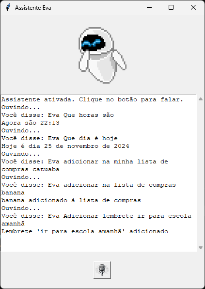

EVA

IMAGEM
Autores

O que é?
Tecnologias
Como executar
Exemplos de comandos

<h1 align="center">Eva</h1>

<div align=center>
    
</div>

<h2>O que é? 🤔</h2>

A <b>Eva</b> é uma assistente virtual desenvolvida para a aula de processamento de linguagem natural, ela interage com o usuário através de uma interface gráfica, permitindo que o usuário dê comandos de voz para realizar tarefas como gerenciar lista de compras e lembretes, além de informar data e hora. A assistente responde aos comandos por meio de voz.

<h2>👩🏾‍💻 Autores</h2>

<table align="center">
  <tr >
      <td align="center"><a href="https://github.com/ericksantos12"><br /><sub><b>Erick Santos</b></sub></a><br />💻</td>
      <td align="center"><a href="https://github.com/GabrielleCGNeves"><br /><sub><b>Gabrielle C G Neves</b></sub></a><br />💻📖</td>
  <tr>
<table>

<h3>🎨 Aplicação</h3>

<div align="center"> 
    
</div>

---

<h3>⛏ Construido com</h3>
<ul>
    <li><a href="https://www.python.org/">Python</a> para integrar bibliotecas para criar uma interface gráfica, reconhecer comandos de voz e realizar a síntese de voz.</li>
    <li><a href="https://docs.python.org/3/library/tkinter.html">Tkinter</a> para criar elementos gráficos que facilitam a personalização do layout da interface.</li>
    <li><a href="https://pypi.org/project/pyttsx3/">Pyttsx3</a> para converter as respostas da assistente em áudio e permitir ajustes no volume, velocidade e tom da voz.</li>
    <li><a href="https://pypi.org/project/SpeechRecognition/">SpeechRecognition</a> para capturar comandos de voz do usuário e traduzi-los para texto.</li>
</ul>

---

<h3>🏁 Como Utilizar</h3>

-   Tenha o Python 3.11 ou maior instalado em sua máquina
-   Clone o repositório

Para instalar as dependências, execute o comando:

```bash
pip install -r requirements.txt
```

Após a instalação, execute o projeto com o comando:

```bash
python assistente.py
```

---

<h3>🗣 Exemplos de comandos</h3>

- Eva, o que você pode fazer?
- Eva, que horas são?
- Eva, que dia é hoje?
- Eva, adicionar na lista de compras _banana_.
- Eva, colocar na lista de compras _leite_.
- Eva, mostrar lista de compras.
- Eva, adicionar lembrete _ir no parque_.
- Eva, adicionar lembrete _ir no mercado_.
- Eva, mostrar lembretes.
- Eva, fechar.
